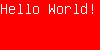
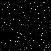
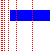

sugar_png    [](https://travis-ci.org/zed-0xff/sugar_png)  [](https://gemnasium.com/zed-0xff/sugar_png)
======


Description
-----------
A pure ruby high-level PNG file creation toolkit.

(If you need a low-level PNG manipulation & analysis toolkit - take a look at [ZPNG](https://github.com/zed-0xff/zpng))

Features
--------
 * neat syntax
 * unicode text drawing support
 * 16-bit color depth support

Installation
------------
    gem install sugar_png

Examples
--------

### Hello World!


```ruby
  SugarPNG.new do
    text "Hello\nWorld!", color: 'red'
    save "out.png"
  end
```

### Explicit image dimensions + bg color


```ruby
  SugarPNG.new do
    background 'red' # or :blue, or #ffee00, or :transparent (default)
    width 100
    height 50
    text "Hello World!", color: '#ffffff'
    save "out.png"
  end
```

### Japanese text with rainbow borders, zoomed 4x


```ruby
  SugarPNG.new do
    border 1, :red
    border 1, :green
    border 1, :blue
    text '水水水'
    zoom 4

    save "out.png"
  end
```

### White noise


```ruby
  SugarPNG.new do
    bg :black  # shortcut for 'background'
    fg :white  # ditto
    width  100
    height 100
    200.times{ pixel(rand(100), rand(100)) }

    save "out.png"
  end
```

### Playing with transparency & 16-bit color depth


```ruby
  SugarPNG.new do |img|
    img.depth = 16

    100.times do |y|
      100.times do |x|
        img[x, y] = [0, 65536*x/100, 0, 65535*y/100] # RGBA
      end
    end

    # 'export' returns PNG image data suitable for streaming to client
    # or manually saving to a file or do whatever you want 
    @data = img.export
  end
```

### Pixels can be set using Ranges, Enumerators & Arrays


```ruby
  SugarPNG.new do |img|
    # Ranges
    img[10...50, 10..20] = :blue
    # Array + Enumerator
    img[[1, 2, 4, 8, 16, 32], 0.step(50, 2)] = :red
    img.zoom = 2 
  end.save("out.png")
```

License
-------
Released under the MIT License.  See the [LICENSE](https://github.com/zed-0xff/sugar_png/blob/master/LICENSE.txt) file for further details.
