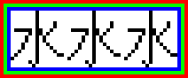

sugar_png    [](http://secure.travis-ci.org/zed-0xff/sugar_png)  [](https://gemnasium.com/zed-0xff/sugar_png)
======


Description
-----------
A pure ruby high-level PNG file creation toolkit

Features
--------
 * neat syntax
 * unicode text drawing support
 * 16-bit color depth support

Installation
------------
    gem install sugar_png

Examples
--------

### Japanese text with rainbow borders, zoomed 4x
```ruby
  SugarPNG.new do
    border 1, :red
    border 1, :green
    border 1, :blue
    text '水水水'
    zoom 4

    save "out.png"
  end
```


License
-------
Released under the MIT License.  See the [LICENSE](https://github.com/zed-0xff/sugar_png/blob/master/LICENSE.txt) file for further details.
